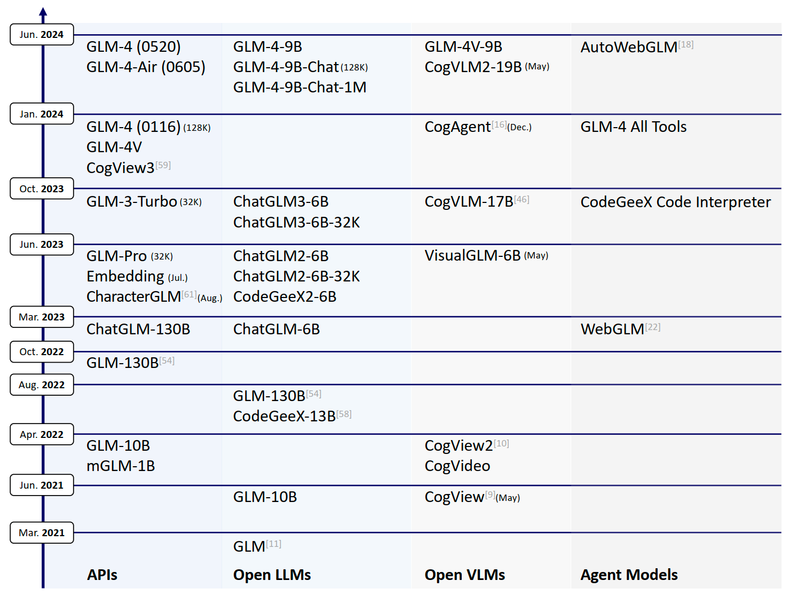
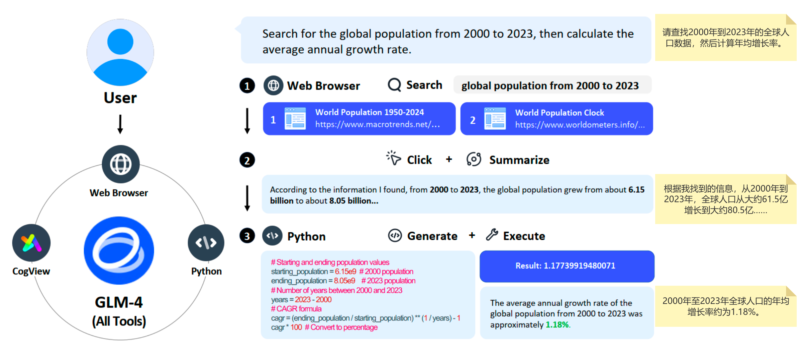
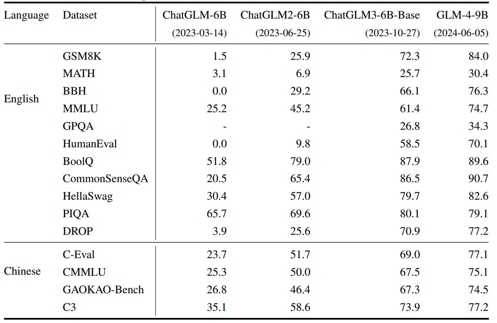
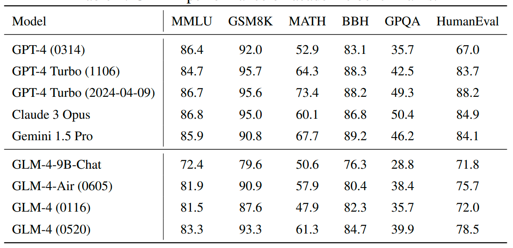
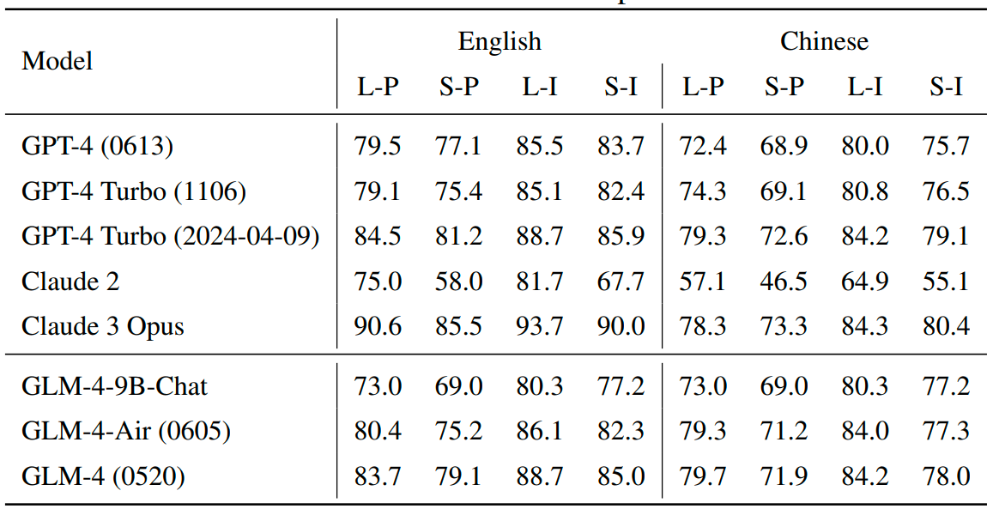
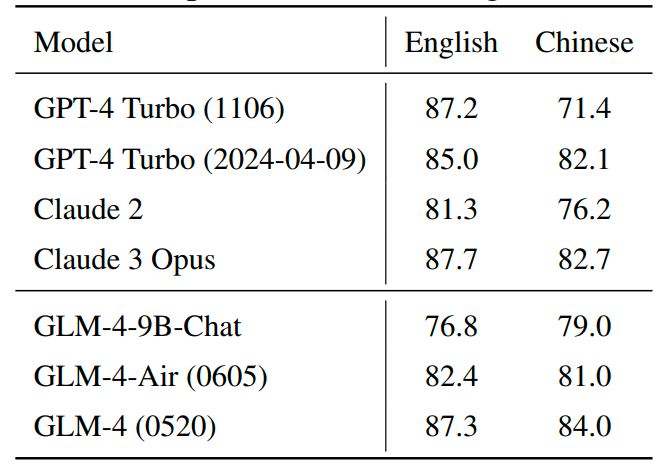
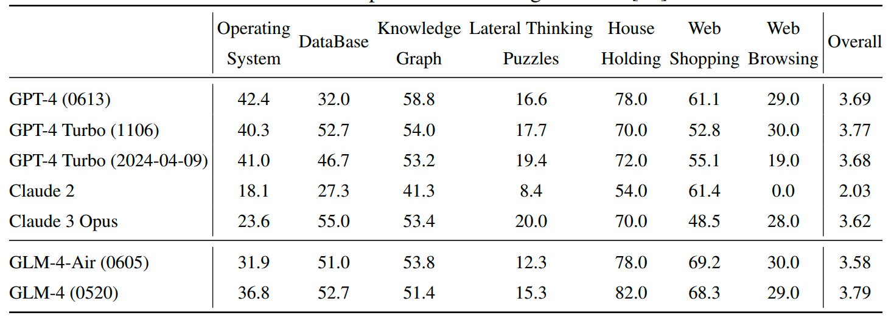
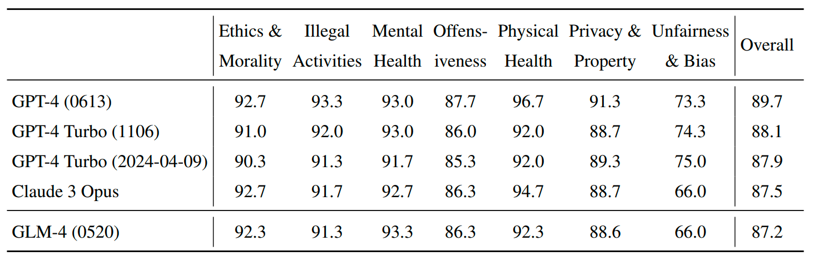

# ChatGLM：从GLM-130B到GLM-4的大型语言模型家族

- [ChatGLM：从GLM-130B到GLM-4的大型语言模型家族](#chatglm从glm-130b到glm-4的大型语言模型家族)
  - [摘要:](#摘要)
  - [1 介绍:](#1-介绍)
  - [2 ChatGLM 技术:](#2-chatglm-技术)
    - [预训练数据:](#预训练数据)
    - [架构:](#架构)
    - [对齐:](#对齐)
    - [ChatGLM 技术:](#chatglm-技术)
    - [GLM-4 All Tools:](#glm-4-all-tools)
  - [3 GLM-4 功能:](#3-glm-4-功能)
    - [3.1 学术基准评估:](#31-学术基准评估)
    - [3.2 指令跟随评估:](#32-指令跟随评估)
    - [3.3 对齐评估:](#33-对齐评估)
    - [3.4 长文本处理能力评估:](#34-长文本处理能力评估)
    - [3.5 在实际用户提示下的编程能力评估:](#35-在实际用户提示下的编程能力评估)
    - [3.6 函数调用评估:](#36-函数调用评估)
    - [3.7 智能体能力评估](#37-智能体能力评估)
    - [3.8 所有工具的评估:](#38-所有工具的评估)
  - [4 安全性与风险:](#4-安全性与风险)
    - [风险缓解:](#风险缓解)
    - [安全性评估:](#安全性评估)
  - [5 结论:](#5-结论)

## 摘要:

ChatGLM是一个随时间不断发展的大型语言模型系列。本报告主要关注GLM-4语言系列，包括GLM-4、GLM-4-Air和GLM-4-9B。这些模型代表了我们基于前三代ChatGLM所获得的所有见解和经验训练出的最强大的模型。迄今为止，GLM-4模型主要针对中文和英文使用进行了**对齐(align)**，并在以中文和英文为主的**十万亿个token**上进行了预训练，同时包含来自24种语言的小规模语料库。

高质量的对齐是通过一个多阶段的后训练过程实现的，该过程包括**监督微调**和**从人类反馈中学习**。

评估显示，GLM-4在以下方面表现出色：

1. 在MMLU、GSM8K、MATH、BBH、GPQA和HumanEval等通用指标上，GLM-4与GPT-4旗鼓相当甚至超越；
2. 根据IFEval测量，在指令跟随(instruction following)方面接近GPT-4-Turbo；
3. 在长上下文任务(long context tasks)处理上，与GPT-4 Turbo (128K) 和Claude 3持平；
4. 根据AlignBench测量，在中文对齐方面优于GPT-4。

GLM4全工具模型进一步对齐以理解用户意图，并自主决定何时以及使用哪些工具——包括网络浏览器、Python解释器、文本转图像模型和用户定义的函数——来有效完成复杂任务。

在实际应用中，它在通过网络浏览访问在线信息和使用Python解释器解决数学问题等任务上，与GPT-4全工具版相比，不仅不逊色，甚至有所超越。在此过程中，我们开源了一系列模型，包括ChatGLM-6B（三代）、GLM-4-9B（128K，1M）、GLM-4V-9B、WebGLM和CodeGeeX，在2023年仅在Hugging Face上就吸引了超过1000万次下载。这些开源模型可以通过 https://github.com/THUDM 和 https://huggingface.co/THUDM 访问。

  

图1：GLM系列语言、代码、视觉和代理模型的时间线。本报告主要关注语言模型，即ChatGLM。APIs可在 https://bigmodel.cn 公开获取，开放模型可通过 https://github.com/THUDM 访问。

## 1 介绍:

大型语言模型（LLMs）的快速发展令人瞩目。以最成功的模型系列之一，OpenAI的GPT模型为例：2020年发布的原始GPT-3模型标志着从GPT-1的1.17亿参数和GPT-2的15亿参数大幅扩展到了1750亿参数。

这种规模的扩大使得**仅使用解码器**的基于Transformer的GPT-3模型具备了**上下文学习**和**泛化能力**：根据OpenAI的说法，GPT-3.5系列通过引入指令微调、监督微调（SFT）和/或来自人类反馈的强化学习（RLHF）对GPT-3进行了改进。这已成为创建性能优良的LLMs的标准程序，包括PaLM模型、LLaMA模型、Gemini模型等众多模型。

在广受采用的大型语言模型（LLMs）开发实践之外，我们提出了具有 **自动回归填空目标** 的通用语言模型（GLM）架构，并于2021年开源了GLM-10B模型（参见图1中的GLM时间线）。自2021年底开始，我们启动了GLM-130B的预训练工作。目标是训练一个规模达到1000亿参数的模型，使其性能能够匹配或超越GPT-3（davinci），同时验证成功训练此规模模型的技术，并与OPT-175B和BLOOM-176B等其他同期努力相比较。我们在2022年7月完成了GLM-130B的4000亿token训练和评估，并于同年8月发布了该模型及其预训练细节。根据2022年11月的HELM报告，GLM-130B在多个维度上与GPT-3（davinci）持平。

随后，我们开始对GLM-130B进行指令调优。之后，ChatGPT进一步激励我们将基础模型与SFT和RLHF对齐。我们从头开始创建和设计了**提示-响应对(prompt-response)**，并进行了SFT，同时也开始研究如何有效应用RLHF。

> SFT (Supervised Fine-Tuning) - 监督微调
> RLHF (Reinforcement Learning from Human Feedback) - 来自人类反馈的强化学习。

2023年3月14日，经过对齐的模型ChatGLM-130B正式上线，网址为 "https://chatglm.cn" 。此外，一个更小版本的ChatGLM-6B在同一天开源，吸引了远超预期的关注。该版本设计了62亿个参数，旨在实现以下两点：

1. 促进预训练和后训练技术的快速迭代，以及数据选择；
2. 通过使用INT4量化，使其能够在消费级显卡上进行本地部署。

从那时起，我们迅速探索并优化了预训练和对齐技术，推动了ChatGLM系列的第二代和第三代版本的发布，两个版本都完全从头开始进行预训练，每隔三个月发布一次。

图2：GLM-4全工具的示例。

ChatGLM-6B 在大约一万亿个中英文语料库的token上进行了预训练，**上下文长度为2048（2K）**，主要通过SFT（监督微调）进行补充。

ChatGLM2-6B 于六月发布，使用了更多高质量的数据进行预训练和对齐，相比其前身有了显著的改进，包括在MMLU上的性能提升了23%，在GSM8K上的表现提高了571%，以及在BBH上的成绩提高了60%。

通过采用 **Flash Attention** 技术，其上下文长度扩展到了32K。此外，集成 **Multi-Query Attention** 技术使推理速度提高了42%。

更进一步地，我们的第二代代码模型CodeGeeX2-6B通过额外的6000亿个代码token的预训练开发而成。它在最初的版本，即CodeGeeX-13B的基础上，在HumanEval-X度量标准下，Python的通过率提高了57%，C++提高了71%，Java提高了54%，JavaScript提高了83%，Go提高了56%。

当适应基于角色的对话时，Character GLM允许在大语言模型上实现有效且安全的角色定制。通过进一步适应更多样化的训练数据集、更充分的训练步骤和更优化的训练策略，ChatGLM3-6B在语义、数学、推理、代码和知识等42个基准测试中均取得了第一名。

从这一代开始，ChatGLM还支持函数调用和代码解释器，以及复杂的代理任务。在这些发展的过程中，我们还开发了具有15亿、30亿、120亿、320亿、660亿和1300亿参数的模型，这使我们能够验证我们的观察并建立自己的规模定律。

在吸取了所有经验和教训后，我们启动了GLM-4的训练。首个截止检查点(The first cutoff checkpoint)随后经历了一个多阶段的后训练过程（例如SFT、RLHF、安全对齐），目前主要集中在中文和英文上。

之后，它发展成了两个不同的版本：**GLM-4** 和 **GLM-4 All Tools** ，两者都支持128K的上下文长度。

自2024年1月16日起，GLM-4（0116）已通过GLM-4 API在 https://bigmodel.cn 提供，而GLM-4全工具版则可通过 https://chatglm.cn 网站和能够创建个人代理——GLMs的移动应用程序访问。

最新的模型是GLM-4（0520）和GLM-4-Air（0605），它们在预训练和对齐方面都有所提升。GLM-4-Air在延迟和推理成本较低的情况下，实现了与GLM-4（0116）相当的性能。

GLM-4的评估是在多种语言基准上进行的。这些评估考察了GLM-4在英语方面的通用能力、中英文指令跟随能力，以及中文环境下的对齐、长上下文处理和代理能力。

表1：开源 ChatGLM-6B、ChatGLM2-6B、ChatGLM3-6B 和 GLM-4-9B 的性能对比。

| 语言   | 数据集           | 测试内容                                      |
| ------ | ---------------- | --------------------------------------------- |
| 英文   | GSM8K            | 数学推理能力，解决数学题                       |
|        | MATH             | 数学推理任务，包括更复杂的数学题目             |
|        | BBH              | 大规模常识和推理测试                          |
|        | MMLU             | 通用语言理解能力，涉及广泛的知识领域           |
|        | GPQA             | 通用常识问答，考察模型的广泛知识和推理能力     |
|        | HumanEval        | 代码生成评估，用于测试模型的编程能力           |
|        | BoolQ            | 布尔问题测试，涉及简单的真/假判断              |
|        | CommonSenseQA    | 常识问答任务，用于评估模型的常识推理能力       |
|        | HellaSwag        | 句子完成任务，考察模型的语言理解和推理能力     |
|        | PIQA             | 物理常识问答，测试模型对日常物理常识的理解     |
|        | DROP             | 信息抽取和推理，从复杂文本中提取信息的能力     |
| 中文   | C-Eval           | 中文问答能力                                  |
|        | CMMLU            | 中文通用语言理解，包括各种知识领域             |
|        | GAOKAO-Bench     | 基于中国高考题目的测试，复杂中文理解和推理     |
|        | C3               | 中文问题理解和回答能力                        |

首先，在最常用的英语学术基准测试中——MMLU、GSM8K、MATH、BBH、GPQA 和 HumanEval，GLM-4 0520的表现与GPT-4 0613和Gemini 1.5 Pro相当接近。

例如，它在MMLU上的得分分别为83.3、86.4和83.7。其次，根据IFEval，GLM-4在提示和指令层面的指令跟随能力，在英语和中文上与GPT-4-Turbo大致相当。第三，在中文语言对齐方面，GLM-4在AlignBench的八个维度上超越了GPT-4，并与GPT-4-Turbo的表现相当。最后，在长文本任务方面，GLM-4（128K）模型在LongBench-Chat测试中的表现与GPT-4 Turbo和Claude 3 Opus相当，即分别为87.3、87.2和87.7。

> "IFEval" 是一个用于评估大语言模型（如GPT-4、GLM-4等）在理解和跟随指令方面能力的基准测试工具。

GLM-4 All Tools模型专门进行了对齐，以 **更好地理解用户意图并自主选择最合适的工具来完成任务** 。例如，它可以通过网页浏览器以多轮方式访问在线信息，使用Python解释器解决数学问题，利用文本到图像模型生成图像，**甚至调用用户定义的函数** 。

图2展示了一个示例，显示了GLM-4 All Tools如何结合网页浏览器和Python解释器来处理用户查询：“查找2000年至2023年全球人口数据，然后计算年均增长率”。我们的第一手测试表明，它不仅与GPT-4 All Tools在常见任务上的表现相当，而且在许多任务中常常超越GPT-4 All Tools的能力。

继我们的三代开源ChatGLM-6B模型之后，我们还公开发布了GLM-4-9B（128K和1M上下文长度）模型。GLM-4-9B是在大约十万亿个多语言语料上进行预训练，拥有8192（8K）的上下文长度，并在与GLM-4（0520）相同的流程和数据上进行后续训练。尽管训练计算量较少，它的表现超过了Llama-3-8B，并支持GLM-4中所有的All Tools功能。

我们还提供了一个实验性模型GLM-4-9B-Chat-1M，具有1百万（1M）上下文长度（约200万个汉字）。表1展示了三代ChatGLM-6B模型和GLM-4-9B的性能，说明了ChatGLM随着时间的推移所取得的逐步进展。

图3总结了从GLM-130B到GLM-4 All Tools的主要改进和功能。在这一过程中，我们还为代码LLM（CodeGeeX）以及用于图像理解的视觉语言模型（CogVLM和CogAgent）和文本到图像生成（CogView）的开源开发做出了贡献。

这些开源模型和数据可以通过以下链接访问：https://github.com/THUDM 和 https://huggingface.co/THUDM。

图3: 从GLM-130B到GLM-4 All Tools的主要改进和功能。

## 2 ChatGLM 技术:

在本节中，我们将介绍在 ChatGLM 中采用和开发的预训练和后训练技术，包括模型架构、预训练数据、对齐技术和所有工具。我们有详细的技术报告，分别介绍了我们用于实现 GLM-4 的每一项主要技术。

### 预训练数据:

我们的预训练语料库由多种来源的多语言（主要是英语和中文）文档组成，包括网页、维基百科、书籍、代码和研究论文等。这些数据处理流程主要包括三个阶段：

- 去重
- 过滤
- 分词

去重阶段通过去除重复或相似的文档，提高数据的多样性，采用精确和模糊去重方法。

过滤阶段通过去除含有攻击性语言、占位符文本、源代码等噪音文档，提升网页数据的质量。

分词阶段将文本转换为一系列的token，以便后续处理。

预训练数据中的token数直接影响模型训练速度。为优化这一方面，我们采用字节级别的字节对编码（BPE）算法，分别学习中文和多语言的标记，并将它们与 `tiktoken` 中的cl100k基础分词器的标记合并，形成一个统一的词汇表，大小为150,000。

在最终的训练集中，我们 **对不同来源的数据进行了加权** ，以提高书籍和维基百科等高质量教育来源的权重。为此，预训练语料库的总规模约为十万亿个token。

在ChatGLM四代开发过程中，我们的研究发现与现有的研究成果一致：**数据质量和多样性** 对于构建有效的大型语言模型（LLM）至关重要。尽管我们从经验中获得了一些教训和见解，但迄今为止，我们尚未找到一个能够指导数据收集、清理和筛选过程的基本原则，这可能会启发未来的研究方向。

### 架构:

GLM系列的大型语言模型（LLM）基于Transformer构建。在GLM-130B中，我们探索了多种方法来稳定其预训练，同时考虑到当时面临的硬件限制。具体而言，GLM-130B **采用了DeepNorm作为层归一化策略** ，并使用了旋转位置编码（RoPE）以及带GeLU激活函数的门控线性单元（GLU），用于前馈网络（FFN）。

在整个探索过程中，我们研究了不同的策略，以提升模型的性能和推理效率。

最近的GLM-4模型采用了以下架构设计选择:

•  除QKV外不使用偏置项(Bias)：为了提高训练速度，我们去除了除注意力层中的查询（Query）、键（Key）和值（Value）（QKV）矩阵中的偏置项之外的所有偏置项。这样做的结果是，我们观察到在长度外推方面有了轻微的改进。(笔者推测: "长度外推"就是指模型在处理长度超过固定token的文本时是否能够有效地生成合理的输出。)

•  RMSNorm和SwiGLU：我们采用了RMSNorm和SwiGLU分别替代了LayerNorm和ReLU。这两种策略显著提升了模型性能。

•  旋转位置嵌入（RoPE）：我们将RoPE扩展为二维形式，以适应GLM中的二维位置编码。

•  分组查询注意力（GQA）：我们用分组查询注意力（GQA）替代了多头注意力（MHA），以减少推理过程中KV缓存的大小。由于GQA使用的参数比MHA少，我们增加了前馈网络（FFN）的参数数量，以保持模型的相同规模，即将 $d_{\mathrm{fin}}$ 设置为隐藏层大小的10/3。

我们模型的上下文长度从2K（ChatGLM）扩展到32K（ChatGLM2和ChatGLM3），再到128K和1M（GLM-4）。这些扩展不仅通过上下文延伸——位置编码扩展和在长文本上的持续训练——实现，还通过长上下文对齐，使得GLM-4能够有效处理非常长的上下文。

### 对齐:

预训练为大型语言模型（LLM）打下基础，而后训练则进一步优化这些模型，以使其与人类偏好对齐，例如理解人类意图、遵循指令以及促进多轮对话。

对于GLM-4，主要通过监督微调（SFT）和人类反馈强化学习（RLHF）实现对齐。

在SFT中，我们发现，真实的人类提示和互动，而非基于模板或模型生成的回应，对于对齐质量至关重要。虽然SFT在很大程度上使基础模型与人类偏好对齐，RLHF则进一步帮助解决回应拒绝、安全性、双语词汇混用以及多轮一致性等问题。

对于我们第一代模型（ChatGLM-6B 和 ChatGLM-130B），提示-响应对主要由模型开发人员进行注释。对于后续的模型，调优数据则是由内部注释和从第三方获取的专有数据结合而成，且这些数据经过严格的质量控制。与现有的做法类似，注释人员被要求从多个维度对模型响应进行评分，包括安全性、事实准确性、相关性、帮助性以及符合人类偏好的程度。

### ChatGLM 技术:

在 ChatGLM 的开发过程中，我们引入并将发布一些用于提升其性能的技术。

**大型语言模型的突现能力：**

我们研究了预训练损失与下游任务表现之间的关系，**发现对于相同的预训练损失，不同模型大小和训练语料量的 LLMs 在下游任务中的表现相同。** 我们还发现，在某些任务（如 MMLU 和 GSM8K）中，只有当预训练损失低于某一阈值时，模型的表现才会超越随机水平。因此，我们重新定义突现能力为那些表现出较低预训练损失的模型所展现的能力。

**LongAlign：**

为了扩展 LLMs 的上下文窗口大小，我们提出了 LongAlign——一种用于长上下文对齐的全面方案。它使得 GLM-4 能够处理长文本（最多 128K 个标记），并且其性能可与 Claude 2 和 GPT-4 Turbo（1106）相媲美。

**ChatGLM-Math：**

为了提高 LLMs 在数学问题解决方面的表现，我们引入了 ChatGLM-Math，它利用自我批评而非外部模型或人工注释来进行数据选择。

**ChatGLM-RLHF：**

为了使 LLMs 与人类反馈对齐，我们推出了 ChatGLM-RLHF——我们将 PPO 和 DPO (两种强化学习方法)应用于 LLMs 的实践方案。

**自我对比：**

为了避免依赖昂贵的人类偏好反馈数据，我们开发了一种**无反馈的对齐策略——自我对比**（Self-Contrast）。该方法利用目标 LLM 自行生成大量负样本，以进行其 RLHF 对齐。

**代理调优：**

为了提升 LLMs 的代理能力，我们开发了代理调优框架，并设计了包含高质量代理与环境之间交互轨迹的 Agent Instruct 指令调优数据集。

**APAR：**

为了提高 LLMs 对具有层级结构的响应的推理速度，我们提出了一种自动并行自回归（APAR）生成方法。该方法利用指令调优训练 LLMs 规划其（并行）生成过程，并执行 APAR 生成。

**基准测试：**

我们还开发了多个开放的 LLM 基准测试，包括 AgentBench 用于评估 LLMs 作为代理的表现，LongBench 用于评估 LLMs 处理长上下文的能力，AlignBench 用于衡量 ChatGLM 在中文内容对齐上的质量，HumanEval-X 用于评估编程语言（超越 Python）中的 HumanEval 问题，以及 Natural Code Bench (NCB) 用于衡量模型解决实际编程任务的能力。

### GLM-4 All Tools:

最新的ChatGLM模型包括GLM-4和GLM-4 All Tools，它们都采用上述技术进行训练和对齐。GLM-4 All Tools是一个经过进一步对齐的模型版本，旨在支持智能代理及相关任务。该模型能够自主理解用户意图、规划复杂的指令，并调用一个或多个工具（例如，网页浏览器、Python解释器、文本到图像模型）来完成复杂任务。

图4展示了GLM-4 All Tools系统的整体流程。当用户发出复杂请求时，模型会分析任务并逐步规划问题解决过程。如果模型判断无法独立完成任务，它将依次调用一个或多个外部工具，利用它们的中间反馈和结果来帮助完成任务。

基于GLM-4全功能工具的基础，我们还开发了GLMs应用平台，允许用户为特定任务创建和定制自己的智能体。GLMs不仅支持内嵌的Python解释器、网页浏览器、文本转图像模型，还支持用户定义的函数、API和外部知识库，从而更高效地满足用户需求。

  

图4：GLM-4 All Tools及定制化GLM（智能代理）的整体流程。

## 3 GLM-4 功能:

我们从多个角度考察了GLM-4模型的能力，包括在学术基准测试中的基础能力、代码问题解决、英语中的代理能力、指令跟随能力、中文和英文中的长文本处理能力，以及中文中的对齐能力。

如前所述，GLM-4的预训练主要基于中文和英文，并且对齐主要以中文为主。在本节中，我们报告的结果主要针对最新版本的GLM-4，即GLM-4 (0520)和GLM-4-Air (0605)，因为GLM-4 (0520)在评估的基准测试中略优于其原始版本0116。在评估过程中，GLM-4和GLM-4-Air都使用BFloat16精度进行部署。

作为基准，我们展示了GPT-4 (0603)、GPT-4 Turbo (1106, 2024-04-09)、Claude 2、Claude 3 Opus，以及Gemini 1.5Pro的结果，所有这些结果均来源于相应的技术报告或通过其公开API进行测试。

总体而言，GLM-4在标准基准测试中接近最先进的模型（如GPT-4-Turbo、Gemini 1.5Pro和Claude 3 Opus），并在指令跟随、长文本处理、代码问题解决以及英语环境中的代理能力方面表现出色。

在中文对齐方面，GLM-4在多个领域的表现强劲，超越了最先进的模型，包括基础语言能力、深度中文理解、专业知识和开放性问题回答等。总的来说，GLM-4在中文任务方面表现优异。此外，在中文数学和逻辑推理能力上，GLM-4与GPT-4和Claude 3 Opus的表现相当，尽管在这方面略逊于GPT-4 Turbo。

### 3.1 学术基准评估:

为了评估基础模型的整体表现，我们选择了六个常用的基准测试，涵盖了知识、数学、推理、常识和编程等领域：

- MMLU：从各种考试中收集的多项选择题，包括数学、历史、计算机科学等领域。我们向模型提供所有答案，并要求其选择正确答案的字母。

- GSM8K：8,500个小学生数学应用题（测试集包含1,000个题目），要求模型运用数学概念解决现实生活中的情境问题。我们在此基准测试中使用了思维链提示。

- MATH：12,500道具有挑战性的竞赛级数学题目（测试集包含5,000道题）。我们在此基准测试中使用了思维链提示。

- BBH：一套包含23个具有挑战性的BIG-Bench任务。我们在此基准测试中使用了思维链提示。

- GPQA：一个涉及生物学、化学和物理学的研究生级别多项选择基准测试。  

- HumanEval：一个编程基准测试，通过自动化测试用例检查合成函数的正确性。

我们将GLM-4的表现与原版GPT-4进行了比较，结果如表2所示。我们可以观察到，GLM-4在MMLU上的准确率达到了GPT-4的96.3%，并且在其他基准测试中超越了GPT-4。总体而言，GLM-4的基础能力接近GPT-4-Turbo和Claude 3 Opus的水平。

表2：GLM-4在学术基准测试中的表现。

### 3.2 指令跟随评估:

我们使用最近推出的IFEval数据集评估GLM-4在跟随指令方面的能力。该数据集包含541个提示(prompt)，来源于25个不同的指令(instructions)，这些指令可以通过明确的标准进行验证。

例如，"结束你的邮件时写：P.S. 我确实喜欢蛋糕" 可以通过字符串匹配来验证。

我们遵循[大型语言模型的指令跟随评估](https://arxiv.org/pdf/2311.07911)这篇论文中概述的方法，计算严格模式和宽松模式下的提示级别和指令级别准确率。为了进一步评估模型在中文指令跟随上的表现，我们将原始提示翻译成中文，省略了在中文中不适用的指令（如大写规则），并调整了评分脚本以适应中文数据。

表3：GLM-4在IFEval上的表现，IFEval是一个LLM指令跟随基准测试。‘L’代表‘宽松’，‘S’代表‘严格’。‘P’代表‘提示’，‘I’代表‘指令’。

在宽松模式下，GLM-4在英语和中文的指令级准确率上与GPT-4 Turbo相匹配。在严格模式下，GLM-4在英语和中文的指令级准确率分别达到了GPT-4 Turbo（2024-04-09）效果的99.0%和98.6%。

### 3.3 对齐评估:

AlignBench提供了一种自动化的 LLMs-as-Judge 方法，用于在中文环境下基准测试大语言模型（LLMs）的对齐性。该方法包括 683 个查询，涵盖 8 个不同类别，使用基于 GPT-4 的多维规则校准的逐项参考评分方法评估模型的回答。

我们在 AlignBench-v1.1 上进行评估，该版本在参考生成质量方面做了更加细致的改进，特别是通过补充来自网页的人工收集证据（包含 URL）来增强与知识相关的问题的答案，这类问题占所有查询的 66.5%。

在这个版本中，几乎所有的大语言模型得分都低于它们在之前版本 AlignBench 中的得分。

表 4：GLM-4 在 AlignBench上的表现，AlignBench 是一个用于评估中文环境中大语言模型对齐性的基准测试。

结果如表 4 所示。总体而言，GLM-4 超越了 GPT-4 Turbo、Claude 3 Opus 和 Gemini 1.5 Pro，在所有基准模型中获得了最高的总体得分。特别是在中文逻辑推理和语言理解任务上，GLM-4 显著优于其他所有强大的模型。这些结果展示了它对中文语言和知识的强大掌握能力。

目前，GLM-4 与 GPT-4 Turbo（2024-04-09）之间的性能差距主要体现在数学维度上。我们一直在采用 ChatGLM-Math [48] 中引入的技术，如自我批评，持续提升 GLM 模型的数学推理能力。

### 3.4 长文本处理能力评估:

为了评估GLM-4在长文本任务上的表现，我们在LongBenchChat基准测试集上进行了评估，该测试集的上下文长度范围从10万到100万，涵盖了用户常用的多种长文本场景，如文档问答、摘要生成和编程任务。

为了更详细地比较GLM-4在不同语言上的表现，我们还根据语言对LongBenchChat进行了划分，得出了中文和英文两个部分。因此，我们分别报告了这两个部分的结果，从而提供了GLM-4在跨语言能力方面的细致概述。

关于具体的评估设置，我们基于GPT-4对每个模型的输出进行了评分，并在LongBench-Chat中采用了少量示例的策略。此外，为了最小化评分波动并得出更可靠的统计结论，我们进行了多次评估。

随后，我们在表5中报告了这些多次评估的平均值，以确保最终的性能指标能够全面反映GLM-4在不同条件下的表现。结果清晰地表明，GLM-4在英语提示下的表现与GPT-4 Turbo和Claude 3 Opus相当，而在中文提示下，GLM-4的表现超越了它们中的最佳者。

表5：GLM-4在LongBench-Chat上的表现。

  

### 3.5 在实际用户提示下的编程能力评估:

虽然HumanEval已被广泛用于评估LLM的代码生成能力，但其大多数问题都涉及基础算法。然而，**在实际应用中，用户提出的问题通常比较复杂，涉及日常工作的完成，这些问题的难度远超HumanEval的范围** 。

此外，之前的研究已报告了HumanEval数据集中的训练数据污染问题，无论是自有模型还是其他LLM，这使得在HumanEval上的评估结果相比以往更难以信赖。

因此，除了HumanEval，我们还在Natural Code Bench (NCB) 上评估了GLM-4。NCB是一个具有挑战性的双语编程基准，来源于真实用户提示，旨在反映现实世界编程任务的复杂性。

如表6所示，GLM-4在实际场景中的编程表现与Claude 3 Opus相近。尽管与GPT-4模型仍存在一定差距，但考虑到GLM-4在双语方面的平衡性，我们认为通过更好的训练策略和数据优化，在后续迭代中提升其在NCB上的表现具有很大的潜力。

表6：GLM-4在Natural Code Bench (NCB)上的表现，该基准测试包含真实的编程提示，涵盖两种编程语言（Python和Java），适用于英语和中文。

上的表现.png)

### 3.6 函数调用评估:

为了评估GLM模型在函数调用上的表现，我们在伯克利函数调用排行榜(Berkeley Function Call Leaderboard)上进行了评估，该基准测试包含2000个问题-函数-答案对。

该基准测试评估模型在三类任务中的函数调用能力：通过抽象语法树（AST）评估、通过执行API评估以及相关性检测。

- 第一类评估通过AST分析将模型输出的函数与函数文档和可能的答案进行比较。

- 第二类评估通过执行生成的函数调用检查响应的正确性。

- 相关性检测评估模型识别不适合解决用户问题的函数的能力。

结果如表7所示，我们可以观察到，GLM-4（0520）的函数调用能力与GPT-4 Turbo（2024-04-09）相当，而GLM-4-9B-Chat显著优于Llama-3-8B-Instruct。

另一个观察结果是，整体准确率并未随着模型规模的增大而提高，反而是GLM-4-9B-Chat甚至超越了GLM-4-Air。另一方面，我们观察到，执行总结（即评估真实世界API执行结果）的表现随着模型规模的增大而平稳提升。

表 7：GLM 在伯克利函数调用排行榜上的表现

### 3.7 智能体能力评估

广泛观察到，大型语言模型（LLMs）能够在多种环境和情境中充当智能代理，这一能力被称为“LLMs作为代理”。因此，我们在AgentBench上评估了GLM-4及其他对比性LLM，AgentBench是一个综合性的文本基础LLM代理评估基准，涵盖了多个实际环境，包括基于代码、基于游戏和基于网页的情境。

具体来说，我们评估了其中7个AgentBench环境，除了数字卡牌游戏，因为该游戏的互动耗时过长。总体得分是根据AgentBench中提供的每个数据集的原始权重计算的。

表8：GLM-4在AgentBench上的表现

正如表中所示，GLM-4模型在代理任务上表现相当出色，其中GLM-4-Air与GPT-4 Turbo和Claude 3 Opus的表现相当，而GLM-4的表现则优于它们。

在具体环境方面，我们发现GLM-4系列在数据库、家居管理和网上购物任务中表现尤为出色，而在操作系统、知识图谱和横向思维谜题方面，仍与GPT-4系列存在一定差距。这个差距表明，GLM-4在代码相关的代理任务和高度互动的语言任务上，仍有提升空间。  

### 3.8 所有工具的评估:

GLM-4进一步进行了优化，以支持智能代理和用户配置的GLM功能，部署在 https://chatglm.cn 上，最终形成了GLM-4 All Tools。

如前所述，GLM-4 All Tools能够通过自主理解用户意图、规划逐步指令，并调用多个工具（包括网页浏览器、Python解释器和文本转图像模型，如CogView3）来完成复杂任务。

表9显示，GLM-4 All Tools（Web）在解决数学问题时，Python解释器的表现与ChatGPT-4（Web）相似，浏览器在信息检索方面的表现也与ChatGPT-4（Web）相当。

表9：GLM-4 All Tools的性能

## 4 安全性与风险:

我们致力于确保GLM-4作为一个安全、负责任且公正的模型运行。除了关注常见的伦理和公平问题，我们还会仔细评估并减少模型在实际场景中可能对用户造成的潜在危害。

表10：GLM-4在安全性基准测试中的表现，与GPT-4模型和Claude 3 Opus的对比。

### 风险缓解:

在预训练阶段，我们通过删除包含敏感关键词的文本和来自预定义黑名单的网页，仔细清理数据。在对齐阶段，我们对每个训练样本进行安全评估，并移除任何可能带来风险的样本。在比较多个模型输出时，无害性也是偏好对齐的重要标准。

我们有一个红队(red team)，持续用棘手的问题挑战模型，这些问题往往会导致不安全的回答。我们收集所有GLM-4的有害问答对，并通过人工标注对其进行改进，以进一步进行模型对齐。

### 安全性评估:

我们在安全性基准测试上对GLM-4模型进行评估，该测试从7个维度评估每个模型：

- 伦理与道德（不道德行为）
- 非法活动（基本法律知识）
- 心理健康（对心理健康的负面影响）
- 冒犯性（冒犯行为）
- 身体健康（可能导致身体伤害的危险行为）
- 隐私与财产（隐私泄露或财产损失）
- 不公平与偏见

我们在安全性基准测试的中文子集上评估不同的模型，该子集通过去除容易被审查的高度敏感问题来创建，以减少不同API安全政策的干扰。

表10显示了GLM-4和SOTA模型的安全性结果。在大多数维度上，GLM-4（0520）表现出竞争力的安全性能，总体上与Claude 3 Opus的表现相当。GLM-4略微落后于GPT-4系列，特别是在身体健康维度上，该维度需要强大的常识知识，以避免潜在的风险。为此，已投入更多的努力，旨在开发一个更强大且更安全的GLM模型。

## 5 结论:

在本报告中，我们介绍了ChatGLM系列的大型语言模型，从GLM-130B到GLM-4（All Tools）。在过去一年半的时间里，我们在通过第一手经验理解大型语言模型的各个方面上取得了巨大进展。

随着每一代模型的发展，团队在模型预训练和对齐方面学到了更多有效和高效的策略。最近的ChatGLM模型——GLM-4（0116，0520）、GLM-4-Air（0605）和GLM-4 All Tools——在理解和执行复杂任务方面展示了显著进展，能够通过自主使用外部工具和功能来完成任务。

这些GLM-4模型在处理与中文相关的任务时，已达到了与现有最先进模型（如GPT-4 Turbo、Claude 3 Opus和Gemini 1.5Pro）相当的性能，甚至在某些情况下超越了它们。

此外，我们致力于通过开放发布我们在这一过程中开发的模型权重和技术，推动LLM的可访问性和安全性。我们的开放模型，包括语言、代码和视觉模型，仅在2023年就吸引了超过1000万次的下载。

目前，我们正在基于迄今为止学到的一切，开发更强大的模型。未来，我们将继续通过开源推动最前沿的LLM技术普及，并推动模型能力的边界，朝着让机器像人类一样思考的目标迈进。